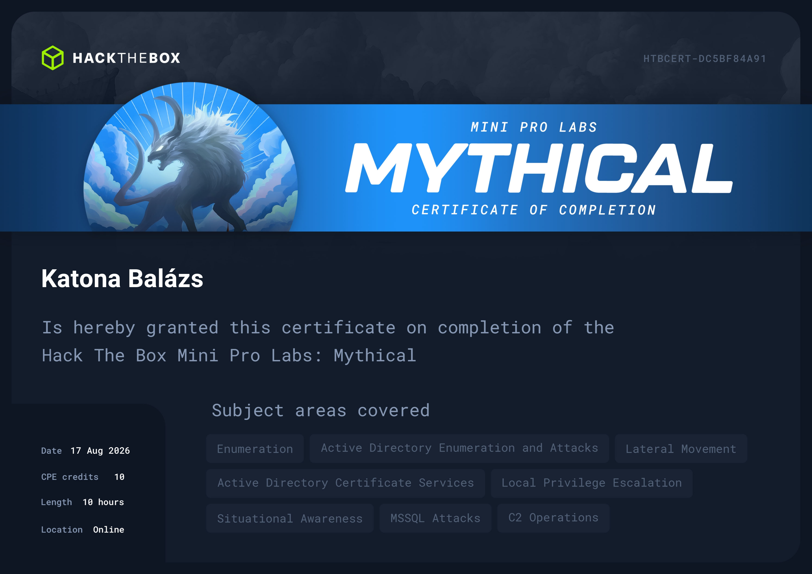

# Hack The Box — Mythical (Mini Pro Lab)

> **Type:** Mini Pro Lab · **Theme:** Active Directory · Assumed Breach · C2 Operations
> **Status:** Active — this is a **spoiler-free completion summary**, not a walkthrough.
> Per HTB content policy, no flags, specific attack paths, or step-by-step solutions are disclosed.



Mythical is an assumed-breach Active Directory lab centered around **Mythic C2** operations. You
start with an operational C2 server and existing agent callbacks, then work through a multi-machine
Windows domain to capture three flags across different network segments.

```
┌─────────────┐     ┌─────────────┐     ┌─────────────┐
│  Mythic C2  │────▶│    DC01     │────▶│    DC02     │
│  (Linux)    │     │  (Windows)  │     │  (Windows)  │
└─────────────┘     └──────┬──────┘     └─────────────┘
                           │
                    ┌──────▼──────┐
                    │ File Server │
                    │  (Linux)    │
                    └─────────────┘
```

---

## Completion

All **3/3 flags** captured:

| Flag | Target | Domain |
|------|--------|--------|
| Backups | File Server | Infrastructure |
| Certified | DC01 | Active Directory |
| Mythical Master | DC02 | Active Directory |

---

## Techniques & Skills Demonstrated

### C2 Operations
- Operating a full **Mythic C2** framework with **Apollo** agents
- Managing agent callbacks, file transfers, and task queuing
- Automating C2 interactions via the **Mythic Python API** and GraphQL
- Working within C2 limitations (beacon health, agent reliability, task serialization)

### Active Directory
- **Cross-domain trust** exploitation between forests
- **AD Certificate Services (ADCS)** misconfiguration abuse
- Service account enumeration and **credential chaining** through password reuse
- Kerberos authentication in multi-domain environments
- NTDS extraction and credential analysis

### Lateral Movement
- Pivoting between network segments through established C2 channels
- **MSSQL** abuse for command execution across trust boundaries
- File transfer techniques through constrained network paths (no direct SMB/HTTP between targets)
- Binary transfer via **SQL parameterized queries** over TDS protocol when all other channels are blocked

### Privilege Escalation
- **MSSQL TRUSTWORTHY** database privilege escalation to sysadmin
- **Token impersonation** via SeImpersonatePrivilege (potato-family attacks)
- **LSASS credential extraction** from memory (WDigest)

### Infrastructure & Problem Solving
- Network enumeration with restricted port access (hosts with minimal open ports)
- Creative file transfer chains when standard methods (SMB, HTTP, UNC) are blocked
- Working around double-hop Kerberos authentication limitations
- Output capture and ACL manipulation for cross-context data retrieval
- Building custom PowerShell tooling for multi-hop command execution

---

## Key Takeaways

1. **Assumed breach changes the game.** Starting with C2 access shifts focus from initial compromise
   to post-exploitation — lateral movement, privilege escalation, and operational security become
   the primary challenges.

2. **Constrained environments force creativity.** When standard file transfer methods are blocked
   (firewall rules, Kerberos double-hop, restricted ACLs), you need to find alternative data
   channels. The SQL protocol itself became a file transfer mechanism.

3. **ADCS remains a critical AD attack surface.** Certificate template misconfigurations can provide
   a direct path to domain admin, often more reliably than traditional credential-based attacks.

4. **Credential extraction is not always on disk.** The final flag required extracting cleartext
   credentials cached in process memory — a reminder that defenders need to think about what's in
   memory, not just what's on disk.

5. **C2 tooling matters.** Understanding the C2 framework's API, its limitations, and how to
   automate interactions through it is as important as knowing the underlying attack techniques.

---

*Completed August 2026. For educational and defensive-security purposes only.*
*All testing was performed in the official HTB lab environment over VPN.*
